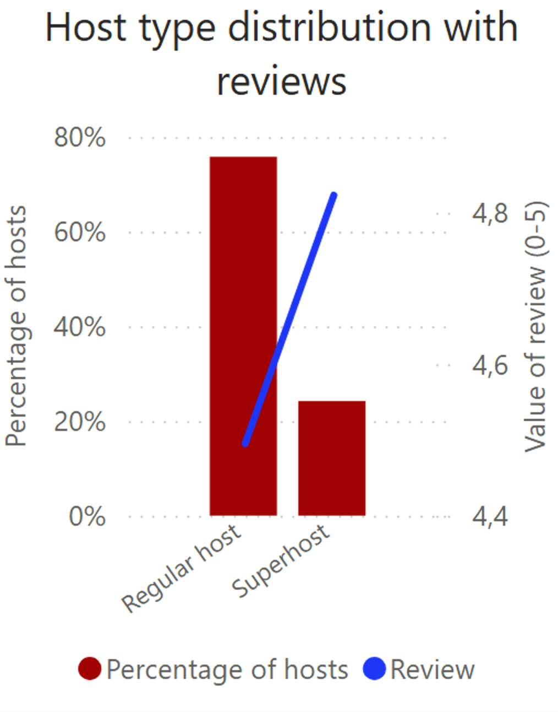
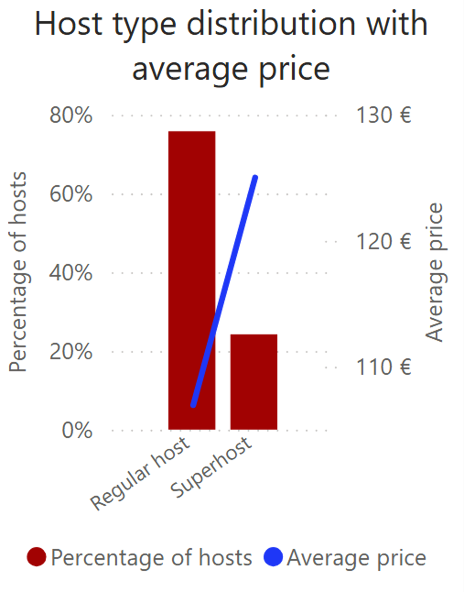

## Introduction

As a passionate traveler, I came across a dataset containing extensive information about Airbnb listings in Barcelona. I was intrigued and decided to dive deeper into it and uncover interesting insights. The dataset comes from [Inside Airbnb](https://insideairbnb.com/get-the-data/) and offers detailed insights into Airbnb listings across the city in 2024\.   
The main goal of my project was to analyze rental data in Barcelona and answer key questions: 

- What does the rental property market in Barcelona look like?  
- What types of properties are common?  
- What is the average rental price, and how are rental prices distributed?  
- Which districts are the best to rent?   
- Which areas are the most profitable for investors?

Before I started visualizing data in Power BI, I analyzed basic statistics and cleaned the dataset. I removed records where prices were above and below 0.05 percentile (above 17 € and below 1070 €) and absent prices because they disrupted my analysis. I also calculated the rental property density in each district based on its area.

## Visualisation

This analysis contains information about 15 554 listings managed by 4 912 hosts, indicating that many hosts have more than one property for rent. The average rental price per night equals 111 €, while the lowest price is 17 € and the highest \- 1058 € per night.

## What properties dominate in Barcelona?

The majority of rented facilities (67,8%) offer the entire place and it’s the best option if you are looking for a home far away from home. You get access to the entire house or apartment. Almost 31% of the facilities are private rooms where you have your own private room for sleeping and might share some spaces with others. There are not many hotel rooms and shared rooms \- they constitute a significant minority due to the specific market focus of airbnb on private rentals.

## Is it profitable to be a superhost?

  

24% of hosts have a "superhost" badge and they charge more and have better ratings than regular hosts. It’s understandable because superhosts have to meet additional requirements like getting enough reservations, maintaining established response rate or avoiding cancellations.  

## How are rental prices distributed?

This chart displays the distribution of rental prices in Barcelona, categorized into different price ranges. The majority of listings fall within the 40-80 € (28%) and 80-120 € (27%) price ranges, meaning most rentals are moderately priced. 15% of available accommodations are under 40 €, suggesting budget options exist but are less common. Higher price brackets become increasingly rare. Prices from 300 € per night constitute only 4% offerts, which means that the premium segment is in minority, but can generate more profits.

## Does larger accommodation reduce cost per guest?

The chart illustrates the relationship between listing capacity and rental prices in Barcelona. The objects destined for 2 and 4 people dominate in Barcelona (51,5%), suggesting a high demand for smaller rentals.  
As expected, the total rental price increases with capacity, reflecting the higher cost of larger accommodations. The average price per guest tends to decrease as capacity rises, indicating that privacy comes at a premium. Notably, for listings accommodating more than 8 guests, there are exceptions where the price per person increases, though these listings represent only 5% of the market. This could be due to premium amenities, unique properties, or limited availability in that category.

## What are the best areas to stay in Barcelona?

The chart shows that the highest number of rental properties is in Eixample, while highest density reveals in Ciutat Vella. There is a significant gap between these two districts and the rest. Eixample, known for its modernist architecture, is popular among hipsters and tourists. It is home to major attractions such as the Sagrada Familia, La Rambla de Catalunya, and Casa Batlló, making it a prime location for tourists. Whereas Ciutat Vella, also called the Old Town, is the oldest district in Barcelona. With landmarks like La Rambla, the Boqueria Market, and the Barcelona Cathedral, it’s easy to see why rental demand is high here. The third most densely populated district in terms of rentals is Gràcia, known for its bohemian, artistic atmosphere. The most popular spot here is Park Güell, which fascinates tourists from all over the world.   
The districts with the fewest rental listings are Nou Barris and Sant Andreau \- these districts are the farthest from the city centre and the Old Town, making them less popular among tourists.

The highest average price is in Eixample, because it’s the most popular place among the tourists. The following three districts are Sant Marti, Sarrià-Sant Gervasi and Les Corts. Sant Marti is located very close to the beach which attracts many tourists. Sarrià-Sant Gervasi is one of the wealthiest districts in Barcelona and is known for its spacious homes, luxury apartments, and private residences, which naturally drive up rental costs. Les Corts offers high average prices even though it is the part furthest away from the sea, but we can find there the iconic FC Barcelona stadium \- Camp Nou. The affordable prices are in Nou Barris and Sant Andreau \- although there we also have the least rental places.   
If we look at average prices per person the situation looks similar.

## Listings on the Map of Barcelona

In the map above, we can see how the properties are distributed across Barcelona's districts. In the Power BI visualization, you can apply filters to the map, allowing you to filter by:

* District,  
* Price,  
* Listing capacity,  
* Room type.

### Recommendations for tourists:

- Most rental listings are available in the range 40-120 € per night.  
- If you’re looking for a budget-friendly accommodation (\<40 €) \- you’ll find it but they're limited.  
- If you prefer higher-quality service and don’t mind paying more, choose an offer from a Superhost.  
- Eixample and Ciutat Vella are central and tourist-heavy districts with the biggest amount of apartments.

### Recommendations for investors:

- If you’re a host \- competitive price from 50 € to 100 € allow you to reach a wide range of tourists.  
- Being a superhost gives you the opportunity to charge higher prices.  
- The luxury segment has fewer listings, which may indicate an opportunity for high margins but requires top quality and excellent reviews.  
- Larger accommodations are more profitable.  
- It’s beneficial to rent a property in Eixample, Sant Marti, Sarrià-Sant Gervasi or Les Corts, as you can set higher rental prices. However, expect intense competition in Exiample.  
- You need to know that Barcelona has strict short-term rental laws so always check local regulations before purchasing a property for Airbnb investment :)
  

**Source:**

[https://insideairbnb.com/get-the-data/](https://insideairbnb.com/get-the-data/)

[https://en.wikipedia.org/wiki/Districts\_of\_Barcelona](https://en.wikipedia.org/wiki/Districts_of_Barcelona)

[https://unexpectedcatalonia.com/barcelona-districts/](https://unexpectedcatalonia.com/barcelona-districts/)

[https://www.locabarcelona.com/en/living-in-barcelona/](https://www.locabarcelona.com/en/living-in-barcelona/)

[https://www.barcelonaturisme.com/wv3/en/page/12/barcelona-district-by-district.html](https://www.barcelonaturisme.com/wv3/en/page/12/barcelona-district-by-district.html)

[https://www.airbnb.com/resources/hosting-homes/a/how-to-become-a-superhost-702](https://www.airbnb.com/resources/hosting-homes/a/how-to-become-a-superhost-702)
